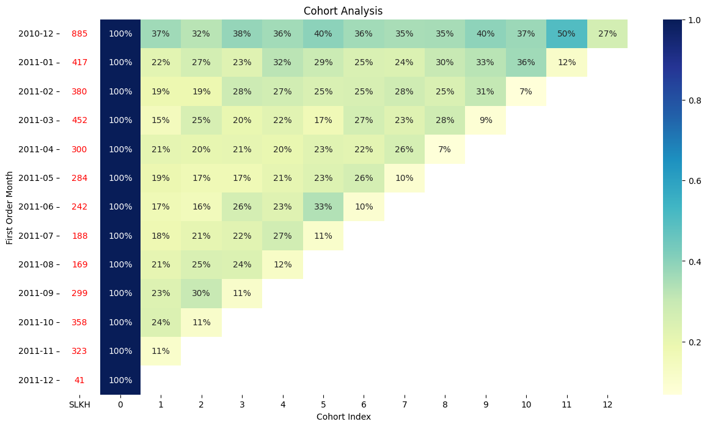

# 📊 Customer Cohort Analysis – Online Retail

Phân tích Cohort giúp bạn hiểu rõ hành vi **giữ chân khách hàng** theo thời gian. Dự án này thực hiện trên tập dữ liệu `Online Retail.csv`, nhằm trả lời các câu hỏi như:

- Khách hàng mua lần đầu vào tháng nào?
- Họ quay lại sau bao lâu?
- Tỷ lệ giữ chân khách hàng theo từng tháng là bao nhiêu?

---

## 🚀 Mục tiêu

- Làm sạch và tiền xử lý dữ liệu giao dịch.
- Xác định thời điểm mua hàng đầu tiên của mỗi khách hàng.
- Tính khoảng thời gian giữa các lần giao dịch.
- Tạo ma trận Cohort thể hiện số lượng và tỷ lệ giữ chân theo từng tháng.
- Trực quan hóa bằng biểu đồ heatmap.

---

## 🛠 Công nghệ sử dụng

- `Pandas` – xử lý dữ liệu
- `Seaborn` & `Matplotlib` – trực quan hóa
- `Python` – phân tích cohort theo thời gian

---

## 📌 Kết quả chính

- Tạo được bảng Cohort cho từng tháng với số lượng khách hàng và tỷ lệ quay lại.
- Hiển thị được tỷ lệ giữ chân dưới dạng phần trăm.
- Cho thấy hành vi mua lặp lại giảm dần theo thời gian, nhưng có một số Cohort vẫn giữ được tỷ lệ duy trì tốt.

---

## 📁 Cấu trúc file

```
📦cohort-analysis/
 ┣ 📄 Online Retail.csv          # Dữ liệu gốc
 ┣ 📄 cohort_analysis.ipynb      # Notebook phân tích đầy đủ
 ┗ 📄 README.md                  # File hướng dẫn tổng quan
```

---

## 📷 Demo trực quan



---

## 💡 Gợi ý ứng dụng

- E-commerce: đo lường hiệu quả chiến dịch giữ chân.
- Product analytics: phân tích tần suất sử dụng/lặp lại.
- Marketing: tối ưu chiến lược chăm sóc khách hàng cũ.

---

## 📬 Liên hệ

Nếu bạn muốn mở rộng project này sang phân khúc, RFM, hay các chỉ số CLV – hãy đóng góp hoặc liên hệ cùng phát triển nhé!

---

## 🐧 Hướng dẫn chạy trên Ubuntu

### 1. Cài Python 3 và venv (nếu chưa có)

```bash
sudo apt update
sudo apt install python3 python3-venv python3-pip -y
```

### 2. Clone repo và tạo môi trường ảo

```bash
git clone https://github.com/tunguyenn99/cohort-analysis.git
cd cohort-analysis
python3 -m venv venv
source venv/bin/activate
```

### 3. Cài đặt thư viện cần thiết

```bash
pip install -r requirements.txt
```

### 4. Mở notebook hoặc chạy script

Nếu bạn đang sử dụng VSCode hoặc Jupyter Notebook:

```bash
# Nếu dùng Jupyter
pip install notebook
jupyter notebook
```

Hoặc mở file `cohort_analysis.ipynb` trong VSCode để bắt đầu phân tích.